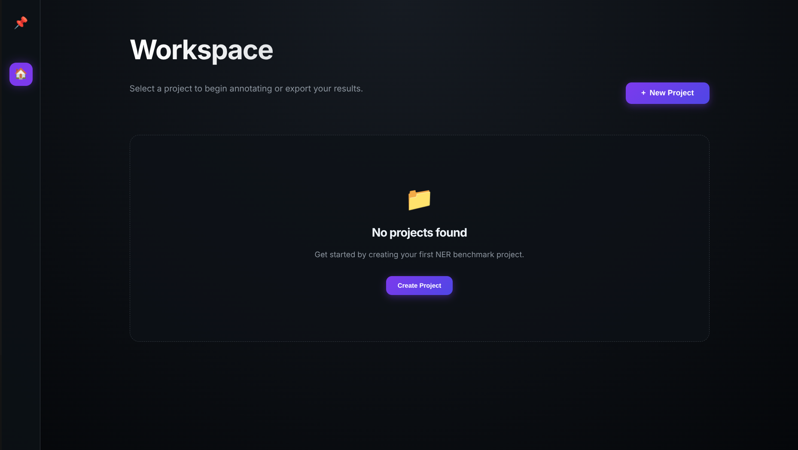

# App Usage Guide

Welcome to the NER Benchmark Platform. This guide will walk you through the complete workflow of managing and annotating your NER projects.

## 1. Creating a New Project
- Click the **+ New Project** button in the Workspace.
- **Project Identity**: Give your project a unique name.
- **SpaCy Model**: Enter the full name of a spaCy model (e.g., `en_core_web_sm`, `en_core_web_trf`). If the model isn't local, the system will attempt to download it automatically.
- **Dataset Upload**: Upload a CSV or Excel file. **Crucial**: The file must contain a column named `texts` containing the strings you want to annotate.

## 2. The Annotation Workspace
Once created, click **Annotate** on your project card.
- **Navigation**: Use the arrows (← →) at the top to move between documents.
- **Automated Results**: The system displays initial predictions from the chosen model.

### Modifying Entities
- **Change Label**: Click on an existing entity to bring up a quick change menu.
- **Change Span**: Click the entity, then select **↔ Change Span**. Select the new text range in the main view and click **Apply**.
- **Delete**: Click an entity and select **Delete Entity**.

### Manual Selection
- Use your mouse to highlight any text not captured by the model.
- A floating menu will appear—select the category to assign.

## 3. Hierarchy & Label Management (IMPORTANT after to buid Knowlege Graphs)
- Use the right panel to manage your **Label Hierarchy**.
- **Nesting**: Drag one label onto another to make it a child.
- **Root Level**: Drag a label to the panel background to move it to the root.

## 4. Verification & Export
- Click **Verify Document** when you are satisfied with a frame.
- On the final document, a **Validate All** button appears for bulk verification.
- Return to the workspace to **Export** your results.
  - **Validated Export**: Documents you've verified.
  - **Config Export**: Project config like model name and labels hierarchy.

## 5. Project Management
- **Rename**: Click the ✏️ icon on the project card to change its name.
- **Delete**: Click the 🗑️ icon to permanently remove a project and its data.

---

### 🎥 Demonstration Video

---
