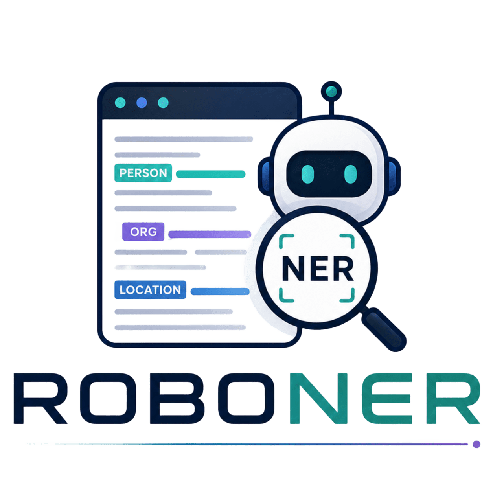

# ROBONER Platform

<p align="center">
  
</p>

A SOTA platform for benchmarking and refining Named Entity Recognition (NER) models. This tool allows you to upload datasets, perform automated inference using spaCy models, and manually verify/correct annotations with a high efficiency frame based UI.

### Clone the repository

```bash
git clone https://github.com/adiren7/roboner.git
cd roboner
```

### Services
```bash
docker compose up -d --build

docker compose down # stop
docker compose down -v # remove volumes
```

- **Frontend**: [http://localhost:8080](http://localhost:8080)
- **Backend API**: [http://localhost:8001](http://localhost:8001) (API Docs: [http://localhost:8001/docs](http://localhost:8001/docs))


## 📂 Data Storage
Project configurations, documents, and annotations are saved in the `backend/data` directory.

- `backend/data/project_registry.json`: Mapping of project names to IDs.
- `backend/data/<project_id>/config.json`: Project settings and label hierarchy.
- `backend/data/<project_id>/docs.json`: All documents and their current entity states.

## 🧠 Custom Model Training

The repository includes a `training.ipynb` notebook that allows you to train your own Named Entity Recognition (NER) model using your annotated data.

- The notebook loads training data directly from the `backend/data` folder.
- It uses the validated annotations created inside the platform.
- You can customize the training pipeline .
- The trained model can be used for your specific needs.

This enables a full workflow:
**Annotation → Training → Evaluation → Improvement**